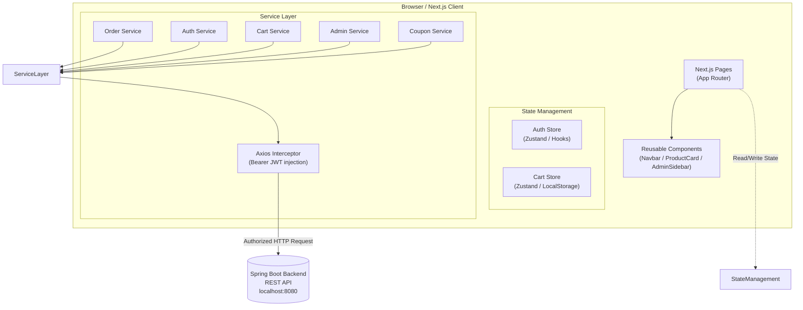
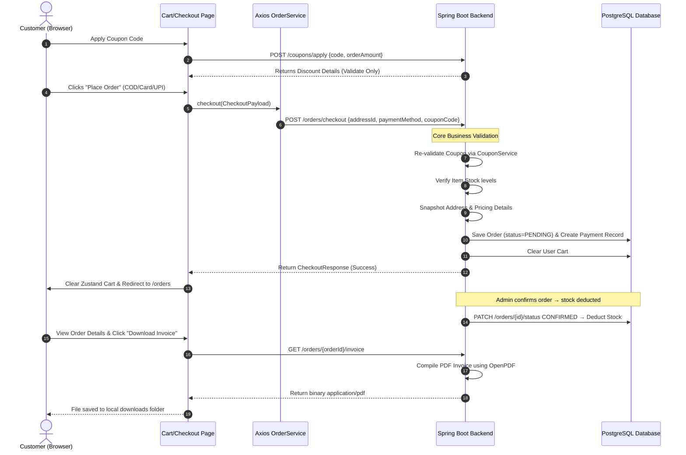

# TechHeaven — Next.js E-Commerce Frontend


A production-ready, full-featured e-commerce store client built with Next.js (App Router), TypeScript, TailwindCSS, and Zustand. Connects securely to the [Smart Commerce Spring Boot REST API](https://github.com/Suryansh-Varma/smart-commerce-backend). Includes a complete Admin Control Panel for managing products, orders, coupons, and users.

---

## Table of Contents

- [Overview](#overview)
- [System Architecture](#system-architecture)
- [Features](#features)
- [E-Commerce Checkout Flow](#e-commerce-checkout-flow)
- [Tech Stack](#tech-stack)
- [Getting Started](#getting-started)
- [Pages & Directory Structure](#pages--directory-structure)

---

## Overview

TechHeaven provides a seamless shopping experience with a premium Apple/Stripe-inspired aesthetic. It communicates entirely with the Spring Boot backend via a secured Axios client that injects JWT tokens on every request.

- **Stateless Session Integration**: JWT tokens are persisted in the auth store and automatically injected into all outbound API requests via Axios interceptors.
- **Client-Side Cache**: Zustand stores provide immediate, optimistic UI updates for cart operations, coupon simulation, and profile details.
- **Out-of-Stock Awareness**: Products with zero stock are visually flagged as "Out of Stock" — add-to-cart is disabled automatically.
- **Admin Control Panel**: A protected `/admin` section allows privileged users to manage the entire platform without touching the backend directly.
- **Premium Aesthetics**: Minimalist, high-end components with responsive layouts, smooth animations, and clean spacing.

---

## System Architecture



---

## Features

### Customer-Facing
- **Product Catalogue**: Browse all products; out-of-stock items show a disabled "Out of Stock" badge.
- **Shopping Cart**: Add items, update quantities, and remove products — synced with backend cart.
- **Coupon Application**: Apply discount codes at checkout with live preview of savings.
- **Checkout**: Select shipping address, payment method, and place order via the backend pipeline.
- **Order History**: View all past orders with full financial breakdown (subtotal, coupon, discount, total).
- **Order Details**: Premium card layout showing shipping info, itemised product table, and payment details.
- **PDF Invoice**: Download a generated invoice for any order directly from the order details page.
- **Order Cancellation**: Cancel PENDING orders from the order details page.
- **My Account**: View and manage profile details and saved addresses.

### Admin Panel (`/admin`)
- **Dashboard**: Real-time stats — total users, orders, revenue, and pending order count.
- **Products**: Add, edit, and delete product listings.
- **Inventory**: Monitor and adjust stock levels per product.
- **Orders**: View all customer orders; update order status (PENDING → CONFIRMED → SHIPPED → DELIVERED / CANCELLED).
- **Coupons**: Create, activate/deactivate, and delete coupon codes (percentage or fixed discount).
- **Users**: Browse all registered user accounts.
- **Analytics**: Platform-level revenue and order trend overview.
- **Settings**: Admin configuration panel.

---

## E-Commerce Checkout Flow



---

## Tech Stack

| Layer | Technology |
|---|---|
| Framework | Next.js 16 (App Router) |
| Language | TypeScript 5 |
| Styling | TailwindCSS |
| State Management | Zustand |
| HTTP Client | Axios (with custom Bearer Token interceptor) |
| Notifications | React-Toastify |
| Build & Dev | Node.js 18+, npm |

---

## Getting Started

### Prerequisites

- Node.js 18.x or above
- A running instance of the [Smart Commerce backend API](https://github.com/Suryansh-Varma/smart-commerce-backend) (defaults to `http://localhost:8080`)

### Installation & Execution

1. Clone the repository:
   ```bash
   git clone https://github.com/Suryansh-Varma/ecommerce-store.git
   cd ecommerce-store
   ```

2. Install npm dependencies:
   ```bash
   npm install
   ```

3. Create an `.env.local` file:
   ```
   NEXT_PUBLIC_API_URL=http://localhost:8080
   ```

4. Start the development server:
   ```bash
   npm run dev
   ```

5. Open your browser at:
   ```
   http://localhost:3000
   ```

### Building for Production

```bash
npm run build
npm start
```

---

## Pages & Directory Structure

```
src/
├── app/                        # App Router Pages
│   ├── page.tsx                # Home / Product Catalogue
│   ├── login/                  # Sign in page
│   ├── signup/                 # Register account page
│   ├── cart/                   # Shopping Cart
│   ├── checkout/               # Checkout form & address selector
│   ├── orders/                 # Order History list
│   ├── orders/[orderId]/       # Order Details & Invoice download
│   ├── myaccount/              # Profile & Address management
│   ├── dashboard/              # Customer dashboard
│   ├── products/[id]/          # Product Detail page
│   └── admin/                  # Admin Control Panel
│       ├── dashboard/          # Admin summary statistics
│       ├── products/           # Product management (list, new, edit)
│       ├── inventory/          # Stock level management
│       ├── orders/             # All orders & status updates
│       ├── coupons/            # Coupon management
│       ├── users/              # User management
│       ├── analytics/          # Revenue & order trends
│       └── settings/           # Admin settings
├── components/                 # Shared layouts & UI components
│   ├── Navbar.tsx
│   ├── ProductCard.tsx
│   ├── ProtectedRoute.tsx
│   └── admin/                  # Admin-specific components
├── services/                   # Axios Client & Service Layer
│   ├── axiosClient.ts          # JWT interceptor setup
│   ├── authService.ts
│   ├── cartService.ts
│   ├── orderService.ts
│   ├── productService.ts
│   ├── couponService.ts
│   └── adminService.ts
├── stores/                     # Zustand state stores
│   ├── authStore.ts
│   └── cartStore.ts
└── types/                      # Shared TypeScript interfaces
```
